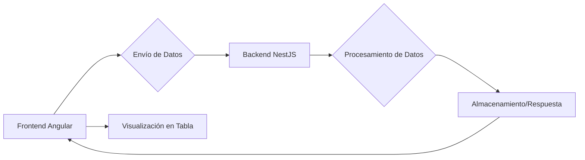
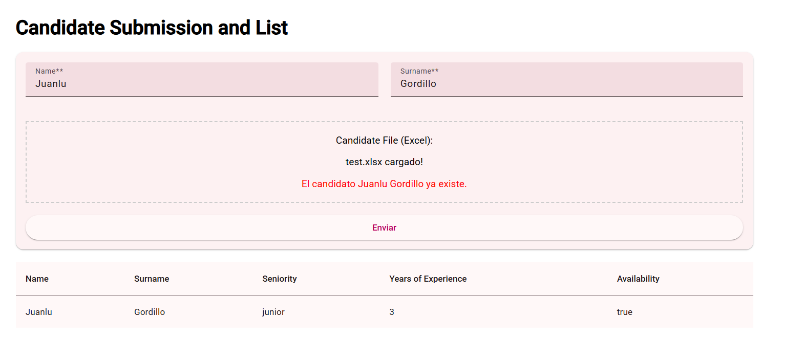
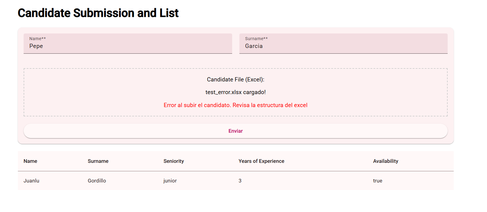
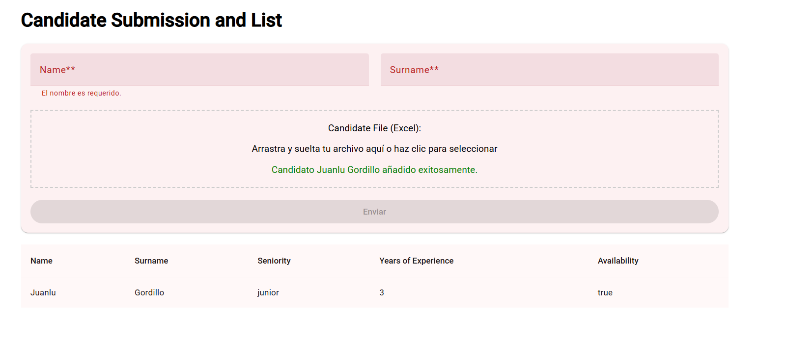

# santander-candidates-list

Este proyecto es una aplicación para la gestión de candidatos, compuesta por un frontend desarrollado en Angular y un backend en NestJS. Permite cargar información de candidatos a través de un formulario, incluyendo datos de un archivo Excel, procesar esta información en el backend y visualizar los candidatos cargados en una tabla en el frontend.

## Arquitectura

El flujo de datos principal de la aplicación es el siguiente:

## Escenarios de Uso

A continuación, se presentan algunos escenarios clave de la aplicación:

### Resultado al detectar candidatos duplicados

Este escenario muestra cómo la aplicación maneja la situación cuando se intenta añadir un candidato que ya existe en la lista.

### Error con archivo Excel de estructura errónea

Este escenario ilustra el mensaje de error que se muestra cuando se carga un archivo Excel que no cumple con la estructura esperada por el backend.

### Resultado exitoso al añadir un candidato

Este escenario presenta la interfaz después de añadir exitosamente un nuevo candidato a la lista.

## Tecnologías

*   **Frontend:** Angular (v16+), Angular Material
*   **Backend:** NestJS
*   **Otros:** Mermaid (para diagramas)